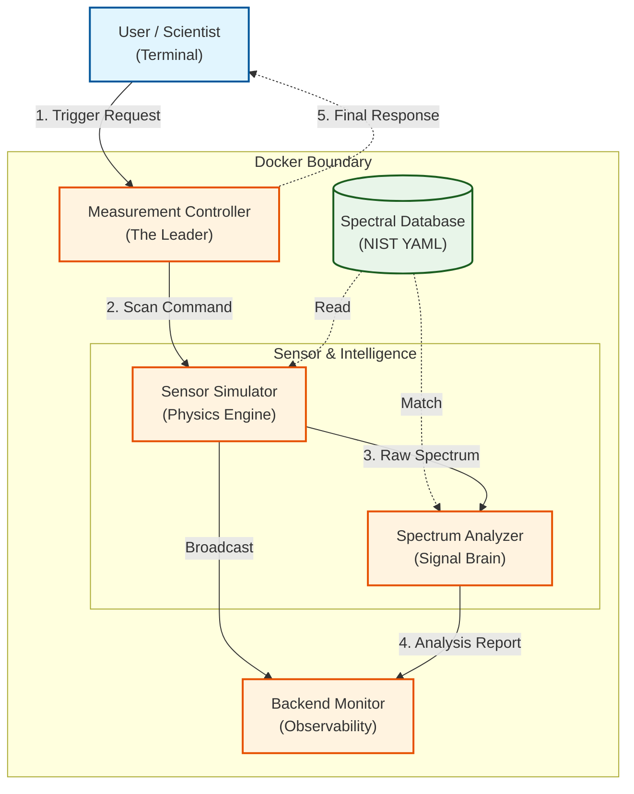

# ROS 2 LIBS Sensor Integration Prototype

[](https://docs.ros.org/en/humble/index.html)
[](https://www.docker.com/)
[](LICENSE)

An advanced, **Physics-Aware Digital Twin** and integration architecture for **Laser-Induced Breakdown Spectroscopy (LIBS)** sensors on mobile robotic platforms. This project simulates the complete lifecycle of a Martian rock analysis mission, from user command to chemical identification.

---

## 🔬 The Science: What is LIBS?

**Laser-Induced Breakdown Spectroscopy (LIBS)** is the "Atomic Fingerprinting" technology used by the **Mars Curiosity (ChemCam)** and **Perseverance (SuperCam)** rovers.

### The Problem it Solves:
When a rover is miles away from a target, it cannot physically "touch" every rock. LIBS allows for **Remote Chemical Analysis**.

### The Physical Process:
1.  **Laser Ablation**: A high-energy laser pulse vaporizes a tiny amount of the rock.
2.  **Plasma Formation**: This creates a 10,000°C+ micro-plasma "spark."
3.  **Atomic Emission**: As the plasma cools, it emits light. Every element (Iron, Silicon, etc.) emits light at **unique NIST wavelengths**.
4.  **Detection**: A spectrometer captures this light, and our "Brain" identifies the elements based on these patterns.

---

## 🏗️ High-Level System Architecture

The project is built using a **Modular, Decoupled Architecture**. Every component is isolated and speaks over a standard ROS 2 network.



---

## 🛠️ Core Engineering Solutions

This project demonstrates several advanced software engineering patterns required for professional robotics:

### 1. The "Deadlock" Solution (Concurrency)
**The Problem**: A node waiting for its own service response can freeze the entire robot brain.
**The Fix**: Implemented a **MultiThreadedExecutor** combined with **ReentrantCallbackGroups**. This allows the Controller to stay responsive and "listen" for the sensor's data while it is still "processing" the user's initial request.

### 2. High-Fidelity Physics Simulation
**The Math**: Instead of using random numbers, the `SpectrumGenerator.py` uses **Gaussian Bell Curve** math to draw peaks at exact NIST wavelengths (e.g., Iron at 374.55nm).
**Realism**: Layered with **Gaussian Electronic Noise** and **Bremsstrahlung Background** (plasma glow), forcing the analysis algorithms to work with "dirty" real-world data.

### 3. Advanced Signal Processing (70/30 Pattern Logic)
**The Algorithm**: The Analyzer doesn't just look for one peak. It uses a **Multi-Peak Signature Verification**:
*   **70% Weight**: Based on the *Presence of the Pattern* (Does it have all the NIST lines?).
*   **30% Weight**: Based on the *Signal Intensity* (How strong is the spike?).
This prevents "False Positives" caused by sensor noise.

### 4. Zero-Code Updates (Centralized Parameters)
**The Design**: Using **ROS 2 Parameters**, the "Laser Power" and "Noise Level" can be changed centrally in the **Launch File**. This allows us to use the same code for 10 different rovers with different sensor hardware without ever recompiling.

---

## 🚀 Getting Started

### 1. Launch the System
```bash
docker compose up --build
```

### 2. Observation
Open a second terminal to see the live data stream:
```bash
docker exec -it libs_rover_ros2 bash -c "source /ros2_ws/install/setup.bash && ros2 run libs_rover_pkg backend_monitor_node.py"
```

### 3. Trigger a Measurement
Run this command from your host machine to "Zap" a rock:
```powershell
docker --% exec -it libs_rover_ros2 bash -c "source /ros2_ws/install/setup.bash && ros2 service call /libs/trigger_measurement libs_rover_pkg/srv/TriggerMeasurement \"{sample_type: 'iron_ore', laser_power_percent: 85.0}\""
```

---

## 📁 Project Structure & Narrative

*   **`libs_rover_ws/`**: The core ROS 2 workspace.
    *   **`src/libs_rover/msg/&srv/`**: The "Language" of the robot (Communication Contracts).
    *   **`src/libs_rover/config/`**: The "Knowledge Base" (NIST signatures).
    *   **`src/libs_rover/libs_rover/`**: The "Brains" (The individual ROS Nodes).
    *   **`launch/`**: The "Orchestrator" (Setting up the whole network at once).
    *   **`Dockerfile`**: The "Environment" (Ensuring perfect consistency).

---

## 🎓 Interview Talking Points

*   **"Why ROS 2?"**: Modularity, real-time potential, and the industry standard for distributed systems.
*   **"Why Docker?"**: To ensure the scientific libraries (SciPy/NumPy) and the ROS middleware are perfectly configured, regardless of the host OS.
*   **"What was the biggest challenge?"**: Optimizing the asynchronous service calls to prevent deadlocks while maintaining high-frequency spectral data transfer.

---

*This project represents a comprehensive "Digital Twin" approach to robotic sensor integration, ensuring software readiness long before hardware deployment.*
